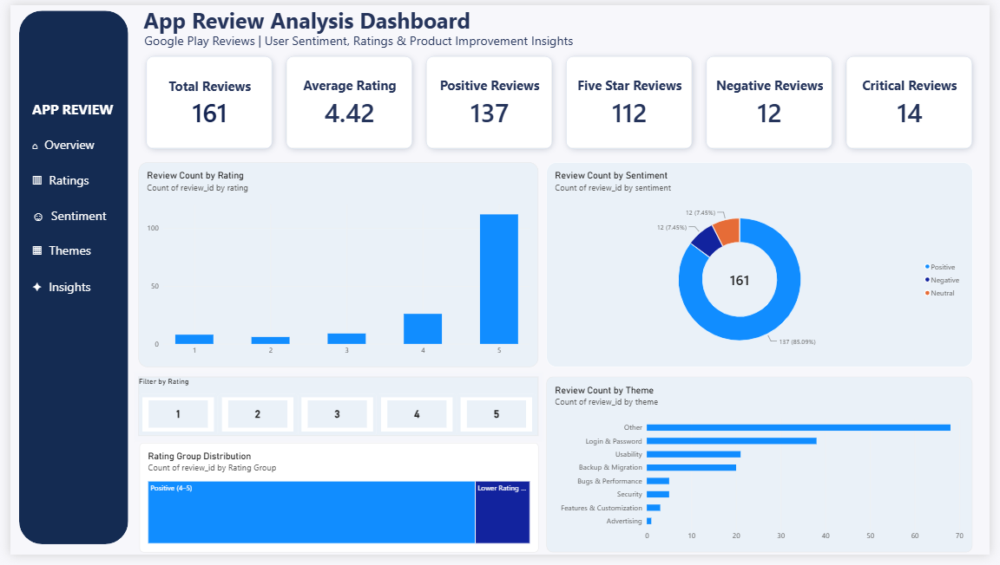

# 📊 App Review Analysis for Product Improvement

A Business Analyst portfolio project analyzing Google Play app reviews to understand user satisfaction, identify recurring feedback themes, and derive product improvement insights.

## 🎯 Project Objective

The objective of this project was to analyze user reviews and answer:

- How satisfied are users with the app?
- What is the overall sentiment of the reviews?
- What product areas receive the most feedback?
- Which areas show relatively lower ratings or negative feedback?
- What product improvements can be considered based on the findings?

## 🛠️ Tools & Technologies

- Python
- Pandas
- VADER Sentiment Analysis
- SQL
- Excel
- Power BI

## 🔄 Project Workflow

**Raw Data → Python → Sentiment & Theme Analysis → SQL → Excel → Power BI → Business Insights**

## 📁 Dataset

The dataset contains **161 Google Play app reviews** with information such as:

- Review ID
- Review description
- Rating
- Thumbs up
- Review date
- Developer response
- App version
- Language
- Country

## 📈 Key Findings

- **161** reviews analyzed
- **4.42/5** average rating
- **85.09%** reviews classified as positive
- **112** five-star reviews
- **38** reviews classified under Login & Password
- **20** reviews classified under Backup & Migration
- Login & Password had **21.05% negative reviews**
- Backup & Migration had an average rating of **3.65/5**
- Usability had an average rating of **4.86/5**

## 📊 Power BI Dashboard

The Power BI dashboard provides an overview of:

- Review rating distribution
- Sentiment distribution
- Rating group distribution
- Review themes
- Key performance indicators
- Rating-based filtering

### Dashboard Preview

## 🐍 Python Analysis

Python and Pandas were used for:

- Data cleaning
- Data preparation
- Sentiment analysis
- Theme classification
- Exploratory analysis

VADER was used to classify reviews into Positive, Negative, and Neutral sentiment categories.

## 🗄️ SQL Analysis

SQL was used to:

- Explore the review dataset
- Analyze rating distribution
- Identify critical reviews
- Examine complaint areas
- Calculate summary metrics

## 📊 Excel Analysis

Excel was used to create:

- KPI summaries
- Rating analysis
- Sentiment analysis
- Theme analysis
- Business insights
- Dashboard analysis

## 💡 Business Insights

The analysis highlighted areas that may require further product investigation, particularly:

- Login & Password
- Backup & Migration
- Bugs & Performance

At the same time, Usability showed strong user ratings and can be considered an area to maintain.

## 📂 Project Files

| File / Folder | Description |
|---|---|
| `Raw Data/` | Original Google Play review dataset |
| `Python Analysis/` | Python data cleaning and analysis |
| `SQL Analysis/` | SQL queries and analysis |
| `Excel Analysis/` | Excel analysis and summaries |
| `Dashboard/` | Power BI dashboard |
| `Report/` | Detailed Business Analyst report |
| `dashboard.png` | Power BI dashboard preview |
